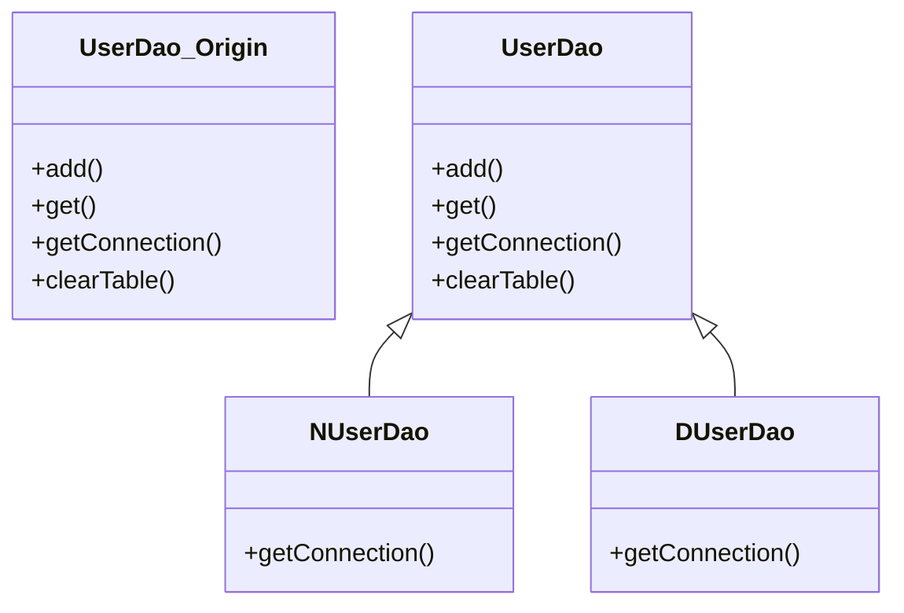
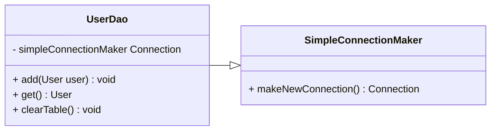

# 챕터 1 

## 1번째 맥락 요약 정리

---

스프링이 가장 관심을 두는 대상은 **오브젝트** 이다.

오브젝트의 생성과 소멸을 다루는 과정에서 설계 과정은 더욱 대두되었다.

따라서, 이러한 관심은 오브젝트 중심의 설계 - **객체지향 설계** 로 이어지게 되었다.

<br/>

객체 지향 설계(Object Oriented design) 에는 크게 3가지가 존재한다.

1. `디자인 패턴` : 기초와 원칙을 비롯해서, 다양한 목적을 위해 자활용 가능한 설계 방법
2. `리팩토링` : 좀 더 깔끔한 구조가 되도록 지속적으로 개선해 나가는 작업
3. `단위 테스트` : 오브젝트가 기대한 대로 동작하고 있는지를 효과적으로 검증하는 데 쓰이는 테스트

<br/>

**토비의 스프링** 은 초급자용은 아닌 만큼, **Spring**의 기반이 되는 저 레벨의 기능부터 시작한다.

따라서, DB 생성 방식은 알려주지 않고 이를 독자가 알아서 만들도록 한다.

나의 방식은 이러하다.

> `Device` : Macbook M1 Pro <br/>
> `Database` : MySQL - Install by Official Website 

이후, 루트 사용자로 MySQL을 접속하여 `springbook` 데이터베이스를 만든다.

루트 사용자로 `springbook`에 대한 모든 권한을 가진 **USER** : `spring` 유저를 만든다.

이후 책에서는 비밀번호를 `book` 으로 설정하는데, 보안을 감안하시는 분이라면,

다른 비밀번호로 설정하는 것이 좋습니다.

<br/>

```shell
$ mysql -u root -p # mysql 루트 사용자로 접속 

# 'spring' 이름의 'book' 패스워드를 가지는 유저를 만드는데, 'localhost'에서 접속 할 수 있습니다.
$ CREATE USER 'spring'@'localhost' IDENTIFIED BY 'book' 

# 'springbook' 에 'users' 테이블을 만들어야 하기에 디비를 생성합니다.
$ CREATE DATABASE springbook;

# springbook 데이터베이스에 대한 모든 권한을 위에서 등록한 'spring' 유저에게 준다는 의미입니다.
$ GRANT ALL PREVILEGES ON springbook.* TO 'spring'@'localhost';

# 등록한 권한이 준비중이므로, 이를 flush 하여 공표합니다.
$ FLUSH PREVILEGES;

# springbook 테이블의 모든 권한을 받은 'spring' 유저로 테이블을 만들기 위해 exit 합니다.
$ exit
```

이후, spring 유저로 `users` 테이블을 만들기 위해 다시 MySQL에 접속합니다.

```shell
# spring 유저로 접속합니다.
$ mysql -u spring -p

# springbook 데이터베이스를 작업하기 위해 들어가는 과정입니다.
$ use springbook;

# 테이블을 생성합니다.
$ CREATE TABLE users (
  id VARCHAR(10) PRIMARY KEY,
  name VARCHAR(20) NOT NULL,
  password VARCHAR(10) NOT NULL
);
```

위의 테이블 생성은 밑의 표로 간단히 확인 할 수 있습니다.

| field name | data type   | configuration |
|------------|-------------|---------------|
| id         | VARCHAR(10) | Primary Key   |
| name       | VARCHAR(20) | Not Null      |
| password   | VARCHAR(10) | Not null      |


이러한 과정을 완료하면, **MySQL**에 `springbook` 데이터베이스를 생성하고,

**Spring** 에서 JDBC 커넥션 풀을 이용해서 정보를 가져오거나 등록 할 수 있습니다!

<br/>

그렇다면, 예제를 사용하기 위해 필요한 **Dependency**는 무엇일까요?

1. MySQL Driver
2. JDBC API

---

## User 클래스

추후 User 클래스를 활용하여 정보를 저장하고, 검증하며, 입력하기 때문에 

이를 담을 수 있는 도메인 객체 또한 필요합니다.

```java
package springbook.user.domain;

public class User {
    String id;
    String name;
    // jdbc 연결과 객체지향 설계 배움에 초점을 맞추기 때문에, 보안설정은 따로 하지 않습니다.
    String password; 
    
    public String getId(){
        return this.id;
    }
    public void setId(String id){
        this.id = id;
    }
    
    public String getName(){
        return this.name;
    }
    public void setName(String name){
        this.name = name;
    }
    
    public String getPassword(){
        return this.password;
    }
    public void setPassword(String password){
        this.password = password;
    }
    
}
```

사실, 아주 기초적인 User 클래스를 제작하였지만

위의 코드는 보다시피 거대한 두 가지의 문제점이 존재합니다.

1. `lombok`을 이용해 `@setter`, `@getter` 애너테이션으로 간단화 하지 않음.
2. `password` 변수를 사용하기 위해 **Authentication** 과정을 거치지 않음.

위의 문제가 대두됨에도 불구하고, Spring 편리 기능의 근간을 알기 위해서는 

이를 직접 작성하며, 앞으로 작성 될 객체의 클래스 위에 편리한 애너테이션의 기능을 알 수 있습니다.

<br/>

---

## UserDao 클래스

위에서, User 오브젝트를 이용해 데이터베이스에서 담아 올 템플릿을 완성했습니다.

하지만, User 오브젝트만을 이용하여 DB의 커넥션을 풀을 가져와 템플릿에 직접적으로 데이터를 담을 수 없습니다.

그렇기에, **Dao** (Data Access Object) 클래스를 제작해 **User** 정보를 가져오는 하나의 오브젝트로서 제작 할 수 있습니다.

<br/>

Spring에 있어서 가장 중요한 것은 관심사죠.

User 클래스가 오브젝트의 값을 담는 도메인 객체로서 활동한다면,

**UserDao** 객체는 `users` 테이블의 정보를 추가하기도 하며, 가져오기도 합니다.

**관심사** : 

1. `User` : 데이터베이스에서 가져온 정보를 템플릿하는 역할 - 도메인
2. `UserDao` : `users` 테이블에 접근하여 원하는 기능을 수행하는 역할 - DataAccessObject

<br/>

일단, CRUD 기능에 앞서 **UserDao**를 통해 기초적인 정보 교환을 알기 위해,

새로운 사용자 생성 - **add**

아이디를 통해 사용자 정보를 가져오기 - **get** 

위의 두 개의 메서드를 만들게 됩니다.

<br/>

책에서 제공하는 JDBC의 일반적인 사용 순서는 이와 같습니다 :

> * DB 연결을 위한 Connection을 가져온다.
> * SQL을 담은 PreparedStatement(or Statement) 를 만든다.
> * 완료 된 (Prepared)Statement를 실행한다.
> * 데이터를 받는 경우, 실행 결과를 ResultSet 오브젝트에 옮긴다.
> * ResultSet 오브젝트에서 각 컬럼의 결과를 User 오브젝트에 옮긴다.
> * 작업 중에 리소스가 할당 된 Connection, Statement, ResultSet과 같은 리소스는 작업 후 반드시 닫는다.
> * **JDBC API**가 만들어 낼 수 있는 exception을 직접 처리, 혹은 메서드에 `throws` 를 선언하여 메소드 밖으로 던지게 한다.

위에서 exception - 예외에 대한 처리가 메서드 단위가 이루어지므로, 

메서드에 SQLException, ClassNotFoundException 이 항상 달려있어야 합니다.

원활한 프로그램 실행을 위해 오류가 일어날 수 있는 코드에 try - catch 문법을 이용하여 처리해야 하나,

책의 저자는 Spring의 설계 원칙을 통한 객체지향 원리에 포인트를 두었으므로, 초반에는 두루뭉술하게 처리한다고 생각해야 합니다.

<br/>

문제는 개인이 DB를 관리해야 하며, 테스팅 환경을 구축해야 합니다.

각 예제마다 **id**를 발급하는데, 1.. 2... 3.. 이런 식으로 기억하기엔 매우 귀찮고, 에러도 날 겁니다.

따라서, 저는 책의 예제와 함께 따로 `clearTable`을 제작해 놓았습니다.

그리고, `DriverClass`에 **MySQL** 커넥션 풀을 가져오기 위한 클래스 이름은 `com.mysql.cj.jdbc` 입니다.

책에는 cj가 써져있지 않는데, cj를 적지 않으면 **deprecated** 경고가 나옵니다.

```java
package springbook.user.dao;

import java.sql.*;

public class UserDao {
    public void add(User user) throws SQLException, ClassNotFoundException {
        Class.forName("com.mysql.cj.jdbc.Driver");

        Connection conn = DriverManager.getConnection(
                "jdbc:mysql://localhost:3306/springbook", "spring", "book"
        );

        PreparedStatement ps = conn.prepareStatement(
                "INSERT INTO users (id, name, password) VALUES (?, ?, ?)"
        );

        ps.setString(1, user.getId());
        ps.setString(2, user.getName());
        ps.setString(3, user.getPassword());
        
        // INSERT, UPDATE, DELETE 와 같이, 자세한 반환 값이 필요없는 경우.
        ps.executeUpdate();

        ps.close();
        conn.close();
    }

    public User get() throws SQLException, ClassNotFoundException {
        Class.forName("com.mysql.cj.jdbc.Driver");
        Connection conn = DriverManager.getConnection(
                "jdbc:mysql://localhost:3306/springbook", "spring", "book"
        );

        PreparedStatement ps = conn.prepareStatement(
                "SELECT * FROM users WHERE id = ?"
        );

        // executeQuery() 는 선택한 결과물 즉 테이블을 반환합니다.
        ResultSet rs = ps.executeQuery();
        rs.next();
        
        User user = new User();
        user.setId(rs.getString("id"));
        user.setName(rs.getString("name"));
        user.setPassword(rs.getString("password"));
        
        rs.close();
        ps.close();
        conn.close();
        
        return user;
    }
    
    // 커스텀 메서드 - 책에 없는 것 
    public void clearTable(){
        Class.forName("com.mysql.cj.jdbc.Driver");
        
        Connection conn = DriverManager.getConnection(
            "jdbc:mysql://localhost:3306/springbook", "spring", "book"
        );
        
        Statement stmt = conn.createStatement();
        
        // springbook DB 의 users 테이블 내부의 데이터를 전부 삭제합니다.
        // 테스팅을 위해 오류를 방지 
        stmt.execute(
            "DELETE FROM users"
        );
        
        stmt.close();
        conn.close();
    }
}
```

책에서 제시하는 JDBC를 이용하는 작업의 일반적인 순서는 다음과 같습니다 :

* **DB** 연결을 위한 `Connection`을 가져온다.
* **SQL** 을 담은 `PreparedStatement` or `Statement`를 만든다.
* 만들어진 `Statement`를 실행한다.
* **SQL** 쿼리의 실행 결과를 `ResultSet` 으로 받아서, `User` 오브젝트에 옮겨준다.
* 작업 중에 생성된 `Connection`, `Statement`, `ResultSet` 리소스는 작업을 마친 후 반드시 닫아준다.
* **JDBC API** 가 만들어내는 **Exception**을 직접 처리하거나, 메서드에 `throws` 를 선언해서 메소드 밖으로 던진다.

<br/>

### main() 메서드를 이용하여 DAO 테스팅하기 

---

`UserDao` 클래스를 이용하여 DB 와 연결되는데,

작성 과정중에 실수가 있을수도 있기 때문에, 테스팅 코드를 작성해야 합니다.

1. `UserDaoTest` 클래스를 패키지에 생성한다.
2. `UserDao` 클래스를 선언하고 인스턴스를 생성한다.
3. `User` 오브젝트를 생성하고, 클래스 변수에 값을 넣어준다.
4. `UserDao` 의 `add(User user)` 메서드를 실행한다.
5. `UserDao` 의 `get(String id)` 메서드를 실행한다.
6. 위 메서드의 결과를 `System.out.println(결과)` 하여 직접 확인한다.

<br/>

```java
public class UserDaoTest {
    public static void main(String[] args){
        // DB 데이터에 접근 할 수 있는 Data Access Object 생성.
        UserDao userDao = new UserDao();
        
        // 앞으로 같은 입력값으로 테스팅해야 하기에, users 테이블에 존재하는 데이터 삭제. - 오류 방지
        userDao.clearTable();
        
        // User 클래스가 가진 set, get 메서드 사용이 번거롭다면, 생성자에 변수 추가를 통해 줄여보세요.
        User user = new User();
        user.setId("1");
        user.setName("MyName");
        user.setPassword("springdata");
        
        // springbook DB에 users 테이블에 user의 정보 추가 
        dao.add(user);
        
        System.out.println(user.getId() + " 등록 성공");
        
        System.out.println(user.getId());
        
        // 이미 생성했던 User 인스턴스에서 id인 "1"을 뽑아 테스팅.
        User user2 = dao.get(user.getId());
        System.out.println(user.getName());
        
        System.out.println(user.getPassword());
        
        System.out.println(user2.getId() + " 조회 성공");
    }
}
```

**Console of Result** :

```text
1 등록 성공
MyName
springdata
1 조회 성공
```

여태까지 DB에 접근하기 위한 초간단 DAO 를 작성하였습니다.

하지만, 객체지향의 원리와 리팩토링까지 고려 해 본다면, 위의 코드들은 문제가 많습니다.

책에서는 이를 **초난감 DAO** 라고 지칭하고 있습니다.

<br/>

## 관심사의 분리

---

단순히 세 가지 기능을 구현하기 위해서는 관심사의 분리는 딱히 필요하지 않을 수도 있습니다.

하지만, 단순히 프론트, 백, 데이터베이스로 나눠진 작은 팀들이 협업한다고 생각한다면,

각자가 가진 고유의 관심사로 기능이 나뉘어 질 수 밖에 없습니다.

<br/>

현재까지 생각 해 본다면, 단순히 Data Access Object를 제작하여

Testing main Method 에서 인스턴스를 생성해 직접 오브젝트를 선언하였으며,

데이터베이스의 정보를 가져오는 역할만 수행하였습니다.

그렇다면, 우리는 책에 써져 있는 중요한 문단을 고려해야 합니다.

<br/>

1. 사용자의 비즈니스 프로세스와 그에 따른 요구사항은 끊임없이 바뀌고 발전한다.
2. 개발자가 객체를 설계 할 때, 가장 염두에 둬야 할 사항은 바로 미래의 변화를 어떻게 대비 할 것인가이다.

당장 구현해야 할 기능이 있는데, 굳이 미래의 변화를 신경써야 할 이유가 무엇일까요?

<br/>

객체지향 설계와 프로그래밍이 번거로운 작업을 요구하는 이유는,

객체지향 기술 자체가 지니는, 변화에 효과적으로 대처 할 수 있다는 기술적인 특징 때문입니다.

실제 상황을 생각 해 보더라도, 요구사항은 3, 4개 수준이 아니라, 수백개의 요구사항을 들어주기 위해서는,

기술적인 특징점들을 분리하여 같은 코드를 수백번 치기 보다는, 수 번으로 줄이는 것이 현명 할 겁니다.

<br/>

따라서, 변경이 일어 날 때 필요한 작업을 최소화하고, 

그 변경이 다른 곳에 문제를 일으키지 않게 해야 합니다.

이를, **분리와 확장**을 고려한 설계 라고 부릅니다.

<br/>

이제 책의 내용을 다시 따라가 보겠습니다.

### 분리

변경에 대한 요청이

"DB를 오라클에서 MySQL 로 바꾸면서, 웹 화면의 레이아웃을 다중 프레임 구조에서 단일 프레임에 Ajax를 적용한 구조로 바꾸고, 매출이 일어 날 때에 지난달 평균 매출액보다 많으면, 감사 시스템의 정보가 웹 서비스로 전송되는 동시에 로그의 날짜 포맷을 6자리에서 Y2K 를 고려 8자리로 바꿔라"

라는 식으로 발생하지는 않습니다.

모든 변경과 발전은 한 번에 한 가지 관심사항에 집중해서 일어난다는 의미입니다.

하지만, 변화를 위와 같이 일어나지만,

작업은 한 곳에 집중되지 않는 경우가 많다는 점입니다.

하나의 작업으로 인해 수백개의 클래스 혹은 메서드를 변경해야 한다면?

`Connection` 을 가져 올 때, "DB URL" ,"spring", "book" 으로 선언했는데,

DB 암호, 혹은 사용 DB가 바뀐다면, DB에 접속하는 모든 메서드를 바꿔야 할 겁니다.

<br/>

위와 같은 현상을 방지하기 위한 기초 개념 중에, **관심사의 분리** (Separation of Concerns) 라는 것이 있습니다.

1. 관심이 같은 것 끼리는 하나의 객체 안으로 또는 친한 객체로 모이게 한다.
2. 관심이 다른 것은 가능한 한 따로 떨어져서 서로 영향을 주지 않도록 분리한다.

<br/>

## 커넥션 만들기의 추출

---

`UserDao` 객체에는 관심사항을 뭉뚱그려서 모두 넣어 놓은 상태입니다.

책에서는 이러한 `UserDao`에 세 가지 관심사항이 존재한다고 써 놓았습니다.

### 1. DB와 연결을 위한 커넥션을 어떻게 가져올까?

더 세분화하여, 어떤 DB를 쓰고, 어떤 드라이버를 사용 할 것이고,

어떤 로그인 정보를 사용하는데, 해당 커넥션을 생성하는 방식은 어떻게 정의하는가?

### 2. DB에 보낼 SQL 문장을 담은 Statement를 만들고 실행하는 것

파라미터로 넘어온 사용자 정보를 `Statement`에 바인딩시키고,

`Statement`에 담긴 SQL을 DB를 통해 실행시키는 방법을 분리.

하지만, 아직까지는 하나로 묶어서 생각합니다.

### 3. 작업이 끝나면, Connection과 비롯된 리소스 오브젝트를 닫아주기

커넥션 풀에서 가져온 리소스 인스턴스들을 닫아줘서, 

소중한 공유 리소스를 시스템에 돌려주는 것입니다.

<br/>

일단, 첫 번째로 관심사인 DB 연결을 위한 Connection을 가져오는 부분이 중복되므로,

이를 `getConnection()` 이라는 독립적인 메서드로 추출하겠습니다.

<br/>

> 변하지 않는 부분은 `...` 으로 치환합니다.

```java
package spring.user.dao;

import java.sql.DriverManager;
import java.sql.SQLException;


public class UserDao {
    public void add(User user) throws SQLException, ClassNotFoundException {
        Connection conn = getConnection();

        // ...
    }

    public User get(String id) throws SQLException, ClassNotFoundException {
        Connection conn = getConnection();

        // ...

        return user;
    }

    public void clearTable() throws SQLException, ClassNotFoundException {
        Connection conn = getConnection();

        // ...
    }

    public Connection getConnection() throws SQLException, ClassNotFoundException {
        Class.forName("com.mysql.cj.jdbc.Driver");
        Connection conn = DriverManager.getConnection(
            "jdbc:mysql://localhost:3306//springbook", "spring", "book"
        );
        
        return conn;
        
        /**
         return DriverManager.getConnection(...) 로 줄일 수 있어요
         */
    }
}
```

나중에, DB 접속 메서드가 2_000 개쯤 되는데, 

DB 연결 관련 정보가 바뀐다고 생각하면 끔찍합니다.

하지만, `getConnection()` 메서드를 구현 해 놓는다면,

`getConnection()` 메서드 하나만 수정 해 준다면 될 일입니다.

<br/>

그리고, 이러한 행위를 **리팩토링** 이라고 부릅니다.

<br/>

## DB 커넥션 만들기의 독립

---

> 이 책의 저자는 실제로 프로그램을 만들어 납품하는 일을 하였고, <br/>
> 적절한 예시를 통해 코드를 구현한다고 생각하시면 됩니다.

<br/>

당신은 이러한 DAO 를 제작했는데, 

인기를 끌어 대형 회사 N사와 D사가 구매하겠다고 주문이 들어왔습니다.

하지만, 문제는 N, D 사가 각기 다른 종류의 DB를 사용하고 있고,

DB 커넥션을 가져오는 데 있어 독자적으로 만든 방법을 적용하고 싶어한다는 점 입니다.

**더욱 큰 문제**는 `UserDao` 를 구매 한 이후에도 

DB 커넥션을 가져오는 방법이 종종 변경 될 가능성이 있다는 점입니다.

<br/>

### 상속을 통한 확장

일단, `UserDao` 에서 메서드의 구현 코드를 제거하고, 

`getConnection()` 을 **추상 메서드** 로 만들어 놓습니다.

이렇게 만들어 놓는다면, 현재 `getConnection()` 을 사용하는 클래스 혹은 메서드들이

**"어찌 되던 일단 Connection 은 가져오게 되어있다"** 라고 인식합니다.

<br/>

그렇다면, N, D사에게 `UserDao` 판매하게 된다면,

N, D 사 각자는 `UserDao` 를 상속한, `NUserDao` 와 `DUserDao` 를 만들게 될 겁니다.

이렇게, **DB 커넥션**이라는 관심을, 상속을 통해 서브클래스로 분리 해 버리게 되는 겁니다.



<br/>

그럼, 상속을 통한 확장 방법이 제공되는 `UserDao` 를 제작 해 보겠습니다.

```java
import java.sql.SQLException;

public abstract class UserDao {
    public void add(User user) throws SQLException, ClassNotFoundException {
        Connection conn = getConnection();
        
        // ...
    }
    
    public User get(String id) throws SQLException, ClassNotFoundException {
        Connection conn = getConnection();
        
        // ...
        
        return user;
    }
    
    public void clearTable() throws SQLException, ClassNotFoundException {
        Connection conn = getConnection();
        
        // ...
    }
    
    public abstract Connection getConnection() throws SQLException, ClassNotFoundException;
}
```

**N** 사의 DB 커넥션 클래스

```java
public class NUserDao extends UserDao {
    @Override
    public Connection getConnection() throws SQLException, ClassNotFoundException {
        // N 사의 독자적인 DB Connection 생성코드
        return conn;
    }
}
```

**D** 사의 DB 커넥션 클래스

```java
import java.sql.SQLException;

public class DUserDao extends UserDao {
    @Override
    public Connection getConnection() throws SQLException, ClassNotFoundException {
        // D 사의 독자적인 DB Connection 생성코드
        
        return conn;
    }
}
```

수정한 코드를 본다면, 

클래스 계층구조를 통해 두 개의 관심이 독립적으로 분리되면서 변경 작업이 한층 용이해졌습니다.

**슈퍼클래스**에 기본적인 로직의 흐름을 만들고,

그 기능의 일부를 추상 메서드나 오버라이딩이 가능한 `protected` 메서드 등으로 만든 뒤,

**서브클래스**에 이런 메서드를 필요에 맞게 구현해서 사용하도록 하는 방법은,

**템플릿 메서드 패턴 (Template Method Pattern)** 이라고 합니다.

또한, 

이렇게 서브클래스에서 구체적인 오브젝트 생성 방법을 결정하게 하는 것을,

**팩토리 메서드 패턴 (Factory Method Pattern)** 이라고 부르기도 합니다.

<br/>

그렇다면, 관심사의 분리는 어떻게 되었을까요?

`UserDao` : 어떤 기능을 사용한다는 데 관심을 둠.

`NUserDao`, `DUserDao` : 어떤 식으로 `Connection` 기능을 제공하는지 관심을 둠.

<br/>

하지만, 이 방법은 **상속**을 사용했다는 단점이 존재합니다.

이유를 생각해 본다면, **Java**는 다중상속을 허용하지 않기 때문입니다.

커넥션 객체를 가져오는 방법, 즉 관심사를 분리하기 위해 상속구조로 만들어버리면,

이후에 다른 목적으로 `UserDao` 에 상속을 적용하기 어렵습니다.

<br/>

## DAO의 확장

---

DAO의 확장에 대해서 논하기 전에,

먼저 **변화의 성격**에 대해서 알아야 합니다.

변화의 성격이 다르다는 건, 변화의 이유와 시기, 주기 등이 다르다는 뜻입니다.

`UserDao`를 예시로 들어 본다면,

JDBC API를 사용할 것인가, DB 전용 API를 사용 할 것인가, 

어떤 테이블 이름과 필드 이름을 사용해 어떤 SQL을 만들 것인가, 등등

이러한 관심사가 바뀌면, 그 때 변경이 일어납니다.

<br/>

여태껏 상속을 이용하여 변화의 성격이 다른 것을 분리하였고,

서로 영향을 주지 않은 채로 필요한 시점에 독립적으로 변경 할 수 있게 했습니다.

하지만, 단점이 많은 **상속**을 이용했다는 것은 불편합니다.

<br/>

### 클래스의 분리

이번에는 `Connection`을 가져오는 과정에서,

아예 상속 도 아니라, 완전히 독립적인 클래스에서 만들어 봅니다.

이렇게 되면, 다중상속이 되지 않는 **Java**에서의 문제점도 해결됩니다.

<br/>



이 과정에서, `UserDao` 클래스는 `new` 키워드를 사용하여

`SimpleConnectionMaker` 클래스의 오브젝트를 만들어 주며,

`add()`, `get()` 메서드를 사용하면 됩니다.

<br/>

그렇다면, 따로 DB Connection을 위한 클래스를 제작하였으니,

이제는 UserDao 클래스가 abstract(추상) 이 될 필요가 없습니다.

<br/>

재 수정 된 `UserDao` - `abstract` 가 없어짐.

```java
import java.sql.SQLException;

public class UserDao {
    private SimpleConnectionMaker simpleConnectionMaker;

    public UserDao() {
        this.simpleConnectionMaker = new SimpleConnectionMaker();
    }

    public void add(User user) throws SQLException, ClassNotFoundException {
        Connection conn = simpleConnectionMaker.makeNewConnection()
        
        // ..
    }
    
    public User get(String id) throws SQLException, ClassNotFoundException {
        Connection conn = simpleConnectionMaker.makeNewConnection()
        
        // ..
        
        return user;
    }
    
    public void clearTable() throws SQLException, ClassNotFoundException {
        Connection conn = simpleConnectionMaker.makeNewConnection();
        
        // ..
    }
}
```

독립시킨 DB 연결 기능인 `SimpleConnectionMaker`

```java
package springbook.user.dao;

import java.sql.Connection;
import java.sql.DriverManager;
import java.sql.SQLException;

public class SimpleConnectionMaker {
    public Connection makeNewConnection() throws SQLException, ClassNotFoundException {
        Class.forName("com.mysql.cj.jdbc.Driver");
        Connection conn = DriverManager.getConnection(
            "jdbc:mysql://localhost:3306/springbook", "spring", "book"
        );
        return conn;
    }
}
```

<br/>

이렇게 클래스를 분리 한 경우에도, 

상속과 마찬가지로 자유로운 확장을 위해서 두 가지 문제를 해결해야 합니다.

1. `SimpleConnectionMaker`의 메서드 문제
2. DB 커넥션을 제공하는 클래스가 어떤 것 인지를 `UserDao` 가 구체적으로 알고 있어야 한다는 점

<br/>

첫 번째 문제로는, 

만약 D 사에서 만든 커넥션 제공 클래스가 openConnection() 이라는 메서드 이름을 사용한다면,

다시 add(), get() 메서드를 전부 변경해야 합니다.

두 번째 문제로는,

`UserDao`가 DB 커넥션을 가져오는 방법을 그 자체인 `SimpleConnectionMaker`로 알고 있다는 것입니다.

오히려 `UserDao`가 DB 커넥션을 가져오는 구체적인 방법에 종속되어 버린다는 것이 문제가 되는 것 입니다.

<br/>

## 인터페이스의 도입

---

관심사는 객체 지향의 디자인에서 굉장히 중요한 요소입니다.

이 때, 추상화는 관심사를 나누는 데 결정적인 역할을 할 수 있습니다.

추상화란, 어떤 것들의 공통적인 성격을 뽑아내어 이를 따로 분리해내는 작업입니다.

그런데, 자바에서 추상화를 위해 제공하는 가장 유용한 도구는 바로 인터페이스입니다.

**인터페이스**는 자신을 구현한 클래스에 대한 구체적인 정보는 모두 감춰버립니다.

하지만, 해당 인터페이스를 사용하는 오브젝트는,

해당 인터페이스가 어떠한 과정을 거쳤던 약속된 오브젝트를 반환하므로,

인터페이스가 무슨 과정으로 만들어졌는지 신경 쓰지 않고, 자신의 관심사를 만족 할 수 있습니다.

<br/>

**Interface** 가 된 `ConnectionMaker` 클래스

```java
package springbook.user.dao;

import java.sql.Connection;
import java.sql.SQLException;

public interface ConnectionMaker {
    public Connection makeConnection() throws SQLException, ClassNotFoundException;
}
```

<br/>

`ConnectionMaker` 를 사용하는 `UserDao`

```java
package springbook.user.dao;

import java.sql.SQLException;

public class UserDao {
    private ConnectionMaker connectionMaker;

    public UserDao() {
        this.connectionMaker = new DConnectionMaker();
    }

    public void add(User user) throws SQLException, ClassNotFoundException {
        Connection conn = this.connectionMaker.makeConnection();
        
        // ..
    }
    
    public User get(String id) throws SQLException, ClassNotFoundException {
        Connection conn = this.connectionMaker.makeConnection();
        
        // ..
    }
    
    public void clearTable() throws SQLException, ClassNotFoundException {
        Connection conn = this.connectionMaker.makeConnection();
        
        // ..
    }
    // ..
}
```

<br/>

`Connection` 을 가져오기 위한 클래스 `ConnectionMaker`를 인터페이스로 제작했음에도 불구하고,

결국엔 D 사가 사용하는 커넥션 클래스 `DConnectionMaker` 가 `UserDao`에 들어있습니다.

이렇게 되면, 또 다시 돌아와서, N 사의 DAO를 만들어 주기 위해 다시 제작해야 하는 상황에 직면하게 됩니다.

<br/>

**무엇이 문제일까요?**

아직 여기서 분리하지 못한 관심사가 하나 더 있습니다.

이는, 

**어떤 DB 커넥션을 가져올 것인가** 에 대한 관심사항입니다.

이는 `UserDao` 가 아닌, 외부에서 직접 구현하여 결정해야 한다는 뜻 입니다.

<br/>

생각 해 본다면, 훌륭한 에디터의 성능 덕분에, 런타임 전에도 에러를 잡아 낼 수 있거나,

어떠한 가능성을 제기해 주는 에디터 덕분에 런타임을 생각하지 않았을 수도 있습니다.

**Interface**는, 런타임 시에 어떠한 오브젝트를 사용할지, 참조할지 결정합니다.

이는, 오브젝트 사이의 관계는 런타임 시에 한쪽이 다른 오브젝트의 레퍼런스를 갖고 있는 방식으로 만들어진다는 뜻 입니다.

<br/>

따라서, 위에서 말했다시피, 인터페이스는 사용하는 클라이언트가 인식하길,

**"이 인터페이스를 사용하여 관심사를 구현하면, 어찌 됐던 생각하는 오브젝트는 무조건 들어온다"** 라고 생각할 수 있습니다.

<br/>

우리는 이를 이용하여,

`ConnectionMaker`를 `UserDao`에서 구현하는 것이 아니라,

`UserDao` 를 사용하게 될 클라이언트에서 이를 직접 결정하게 두는 것 입니다.

```java
package springbook.user.dao;

public class UserDao{
    private ConnectionMaker connectionMaker;
    public UserDao(ConnectionMaker connectionMaker){
        this.connectionMaker = connectionMaker;
    }
    /**
     UserDao의 메서드들....
     */
}
```

<br/>

**테스트 할 main() 메서드**

```java
import java.sql.SQLException;

public class UserDaoTest {
    public static void main(String[] args) throws SQLException, ClassNotFoundException {
        // 테스팅 하는 메서드::클라이언트 , ConnectionMaker::서비스
        ConnectionMaker connectionMaker = new DConnectionMaker();
        
        // 클라이언트인 테스트코드가 어떠한 DB 커넥션을 사용할 지 결정하였다. - 관심사의 분리 
        UserDao userDao = new UserDao(connectionMaker);
    }
}
```

<br/>

`UserDaoTest`는 `UserDao`와 `ConnectionMaker` 구현 클래스와의 런타임 오브젝트 의존관계를 설정하는 책임을 담당하게 되었다.

따라서, 특정 ConnectionMaker 구현 클래스의 오브젝트를 만들고,

`UserDao` 생성자 파라미터에 넣어 두 개의 오브젝트를 연결해 준다.

이렇게, `UserDao`에 있으면 안 되는 관심사항인, **어떤 DB를 사용 할 것인가**를 클라이언트에게 떠 넘길 수 있었습니다.

<br/>

이런 식으로, 본연의 관심사인 **사용자 데이터 엑세스 작업** 을 위해

**SQL** 을 생성하고, 이를 실행하는 데만 집중 할 수 있게 되었습니다.

